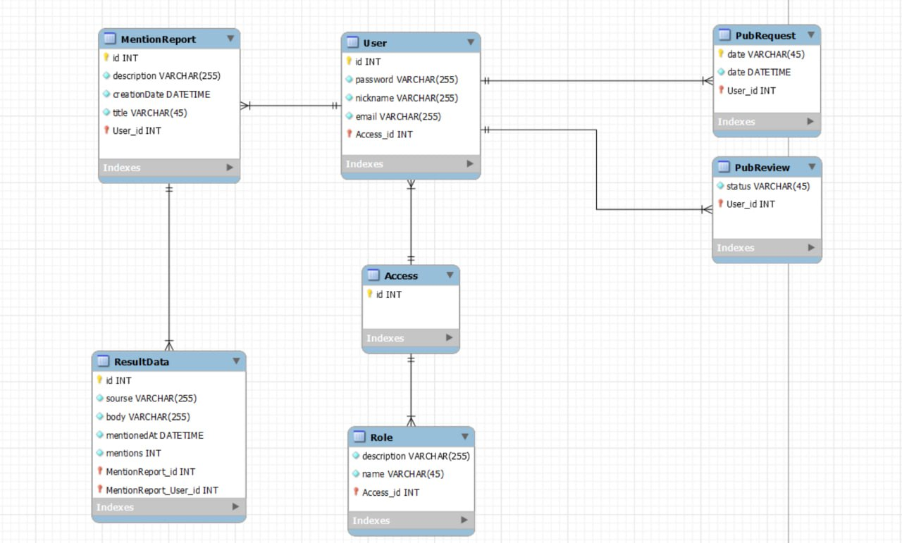

# Проєктування бази даних
## Модель бізнес-об'єктів

@startuml

entity User #6f91c7 
entity User.id #e9f2d5 
entity User.nickname #e9f2d5 
entity User.email #e9f2d5 
entity User.password #e9f2d5

User *-r- User.id 
User *-d- User.nickname 
User *-d- User.email 
User *-l- User.password

entity Role #6f91c7 
entity Role.name #d7dbb4 
entity Role.description #d7dbb4

User "0,"--"1,1" Role

Role *-d- Role.description 
Role *-d- Role.name

entity MentionReport #6f91c7 
entity MentionReport.id #b9bd9d 
entity MentionReport.description #b9bd9d 
entity MentionReport.creationDate #b9bd9d 
entity MentionReport.title #b9bd9d

User "1,1"-u-"0,*" MentionReport

MentionReport *-u- MentionReport.id 
MentionReport *-u- MentionReport.description 
MentionReport *-u- MentionReport.creationDate 
MentionReport *-l- MentionReport.title

entity ResultData #6f91c7 
entity ResultData.id #dbce9e 
entity ResultData.mentions #dbce9e 
entity ResultData.mentionedAt #dbce9e 
entity ResultData.source #dbce9e 
entity ResultData.body #dbce9e

MentionReport "1,1"--"0,*" ResultData

ResultData *-r- ResultData.id 
ResultData *-u- ResultData.mentions 
ResultData *-u- ResultData.mentionedAt 
ResultData *-d- ResultData.source 
ResultData *-l- ResultData.body

entity PubRequest #6f91c7 
entity PubRequest.date #cfb899 
entity PubRequest.name #cfb899

User "1,1"-u-"0,*" PubRequest 
PubRequest *-u- PubRequest.date 
PubRequest *-d- PubRequest.name

entity PubReview #6f91c7 
entity PubReview.status #cfa899

User "1,1"--"0," PubReview 
PubReview "0,"--"1,1" PubRequest 
PubReview *-r- PubReview.status

@enduml
  
## ER-модель

@startuml
  
entity ResultData <<ENTITY>> {
    id: NUMBER
    sourse:TEXT
    body: TEXT
    mentionedAt: DATE
    mentions: NUMBER
}

entity MentionReport <<ENTITY>> {
    id: NUMBER
    description: TEXT
    creationDate: DATE
    title: TEXT
}

entity User <<ENTITY>> {
    id: NUMBER
    password: TEXT
    nickname: TEXT
    email: TEXT
}

entity Role <<ENTITY>> {
    id: NUMBER
    name: TEXT
    description: TEXT
}

entity PubReview <<ENTITY>> {
    status: TEXT
}

entity PubRequest <<ENTITY>> {
name: TEXT
date: DATE
}

MentionReport "1,1"--"0,*" ResultData
User "1,1"--"0,*" PubReview
PubRequest "1,1"--"0,*" PubReview
User "1,1"--"0,*" PubRequest
User "1,1"--"0,*" MentionReport
User "0,*"--"1,1" Role

@enduml

## Реляційна схема

  

